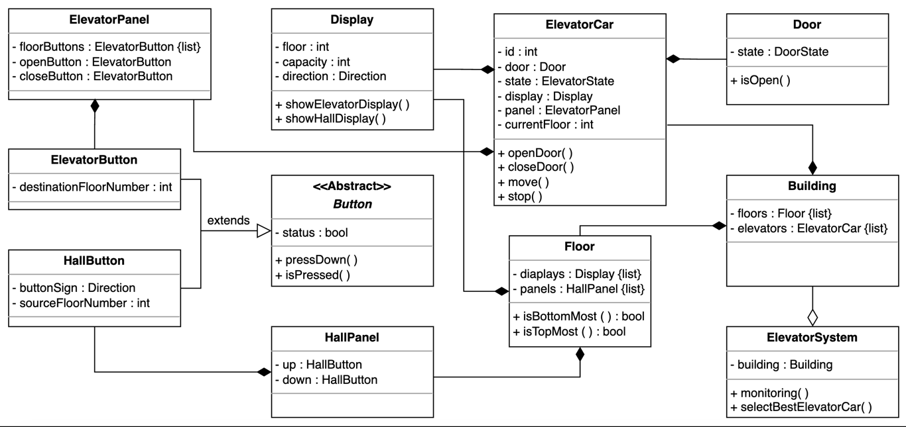
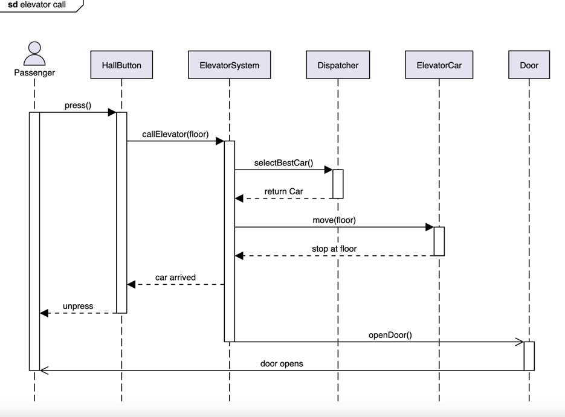
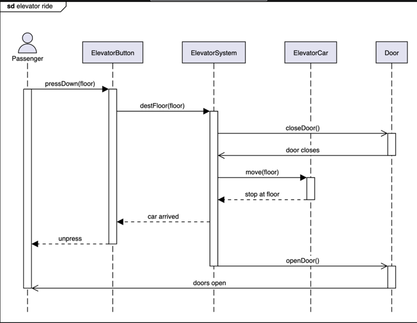

## Design Elevator System

An elevator is an integral part of buildings that have multiple floors. The elevator car could be in different states, either up or down, or could be stopped on some floor. Anyone can request an elevator car from any floor using the buttons on the panel. The elevator car’s algorithm will set the priority and take action accordingly, so the wait time is minimum. Inside an elevator, there will be a panel for passengers to select the floor on which they want to go. The elevator car will have a fixed capacity for the number of passengers and a display to show on which floor the elevator car is currently located.

### Requirement collection
For the elevator design problem, the requirements are defined below:

1. There exist multiple elevator cars and floors in the building.
2. The building can have a maximum of 15 floors and three elevators.
3. The elevator car can move up or down or be in an idle state.
4. The elevator door can only be opened when it is in an idle state.
5. Every elevator car passes through each floor.
6. The panel outside the elevator should have buttons to call an elevator car and to specify whether the passenger wants to go up or down.
7. The panel inside the elevator should have buttons to go to every floor. There should be buttons to open or close the lift doors.
8. There should be a display inside and outside the elevator car to show the current floor number and direction of the elevator car.
9. The display inside the elevator should also show the capacity of the elevator car.
10. Each floor has a separate panel and a display for each elevator car.
11. Multiple passengers can go to the same or different floors in the same or opposite direction.
12. The elevator system should be able to control the elevator car movement and the door functioning and monitor the elevator car.
13. The elevator control system should be able to send the most appropriate elevator to the passenger when the passenger calls the elevator car.
14. The elevator car can carry a maximum of eight persons or 680 kilograms at once.

### Relationship-diagram

### Design pattern
The ****Strategy** design pattern** can be applied here since the system could have multiple dispatch request strategy classes. Therefore, depending on the particular layout of the building and its scenarios, we choose a set of dispatch request strategy classes.

We can also use the **State and Delegation design pattern** for this problem. Instead of implementing all methods on its own, the context object stores a reference to one of the state objects that represents its current state and delegates all the state-specific tasks to that object. For example, elevators have multiple states like working or idle, etc. Based on the state, the system infers which method or behavior of the elevator should be invoked.

### Elevator Strategies
1. First Come First Serve (FCFS)
2. Shortest Seek Time First (SSTF) 
3. SCAN is also known as the Elevator Algorithm
4. LOOK is also known as the look-ahead SCAN algorithm

### Sequence-diagram for elevator call

### Sequence-diagram for elevator rode
 
