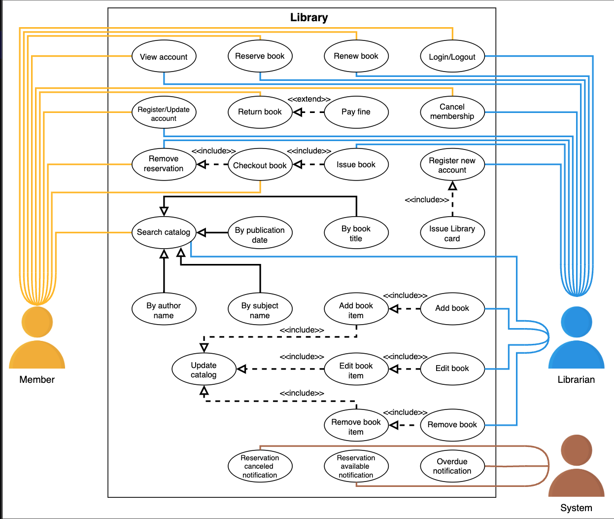
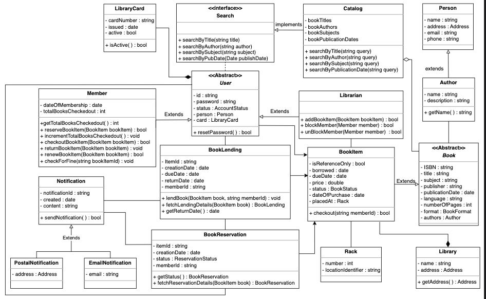
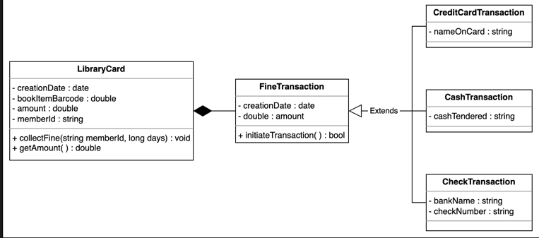
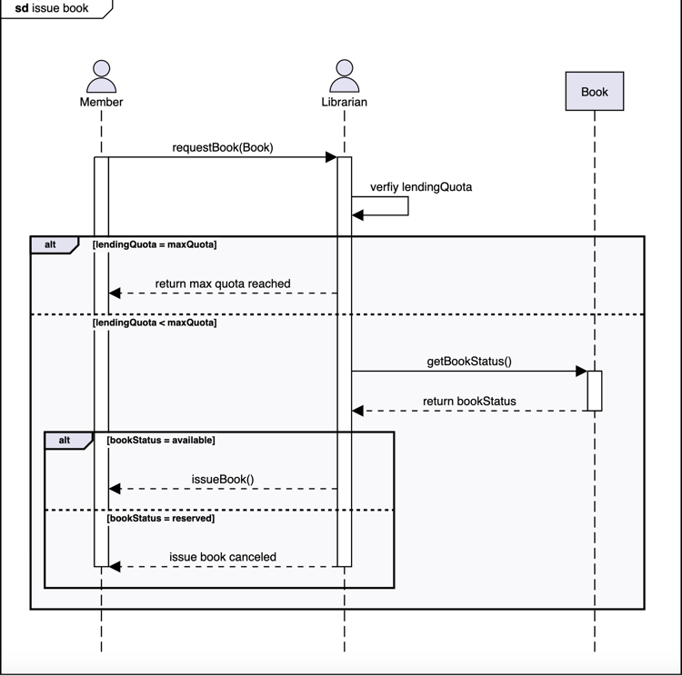
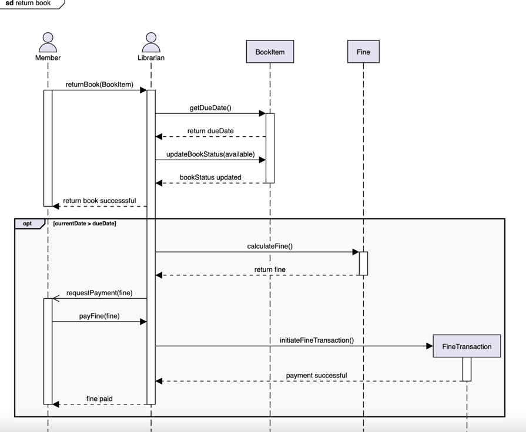

## Library Management System (LMS)

A library management system is a software that automates library activities and helps manage
all primary functions of library management. It organizes and maintains records of books
and members, tracks the number of books in the library, manages borrowed and returned books,
and keeps track of fines on late returns. It also supports maintaining the physical library 
by helping users locate books and check their availability. Overall, the system stores 
and updates the complete library database, making it efficient for organizing and retrieving 
library data.Position of the book in the library and can search for whether or not the specific
book is currently available in the library. Therefore, LMS helps organize and retrieve 
library data in an efficient manner.

### Requirements
R1: The system should be able to store the information about books and members of the library. Moreover, the complete log of the book borrowing process should also be stored.

R2: Every book is supposed to have a unique identification number and other details including a rack number to help locate the book physically.

R3: Every book should have an associated ISBN, title, author name, subject, and publication date.

R4: There can be multiple copies of the book. Each copy will be recognized as a book item.

R5: There can be two types of users, i.e., the librarian and the members.

R6: Every user must have a library card with a unique card number.

R7: One member can issue a maximum of 10 books at a time.

R8: The member can issue a book for a maximum of 15 days.

R9: Each book item can only be reserved by a single member.

R10: The system should be able to keep a record of who issued or reserved a particular book and on which date.

R11: The system should allow the user to renew the reserved book.

R12: The system should send a notification if the book is not returned within the due date.

R13: If the book is currently not available, then the member should be able to reserve it for whenever it is available.

R14: The system should allow the user to search a book by its title, author name, subject, or publication date.

### Use case Diagram

### Class Diagram

### Fine Collect Class Diagram

### Sequence Diagram - Issue Book

### Sequence Diagram - Return Book

### Design Patterns we can use
1. **Factory** - we can create a BookFactory class to create a book object in an arranged manner.
2. **Delegation** - delegate a task from one class to another class. For example, librarian functionalities like adding book items, deleting book items, or modifying book items are actually implemented in the BookItem class. The Librarian class uses the BookItem class and has access to its data and methods
3. **Observer** - For example, if a member searches for a book that is unavailable at that time, then the observer interface system will notify the member when that book is available for reservation.
4. **Decorator** - Fine functionality
5. **FCFS** - Conflict resolution at booking

